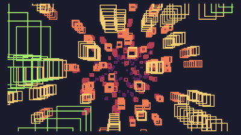

# cracklebass - 512b intro - Inércia 2021

This repository contains the unpacked and commented source for the
TIC-80 512b intro cracklebass, made by pestis / brainlez Coders! and
released at Inércia 2021 512b compo.

We draw several z-layers from far to near, and in each layer, we draw
one big ellib or rectb, as a tunnel, and then we draw 10 things flying
in the tunnel (elli, ellib, or rectb).

Music is tracked, with each channel having an order list of length 8.
Each pattern is also 8 elements long but they are played at different
speeds (in powers of 2) for each channel. Order list advances at the
same for all channels so for a slow channel, pattern might play twice
before advancing the order list, while for a fast channel a pattern
might play e.g. 8 times before the order list advances. Every note has a
linearly decaying envelope, the last channel also has a fast pitch decay
(kick).

Tested with TIC-80 0.90.1723, packed with
[pactic](https://github.com/phlubby/pactic). pactic should pack it down
to 512 bytes. Remember to add -c option. I got irritated enough by
several things in TIC-80, so I fixed them (e.g. fixing audio crackling
issues, increasing TIC-80 api call performance from LUA). My fork
resides in [here](https://github.com/vsariola/TIC-80).

Tricks learned:
  - `debug.sethook()` removes the ability to force-exit LUA, but
    increases the performance somewhat.
  - `poke(16379,1)` hides the cursor. Any self-respecting intro has
    to invoke this.
  - `load'e,n,i,j,k=...rectb(e-i,n-j,i+i,j+j,k)'` creates a function
    to draw centered rectangles, thus closer to ellib API. This allowed
    switching between ellib and rectb and get comparable results.
  - When pleasing the DEFLATE algorithm, it is usually the most
    effective to not define any temporary variables, and just evaluate
    entire expressions again every time you would use a temporary
    variable. If the expression appears more than once in the code, the
    DEFLATE algorithm replaces the second appearance with a
    backreference; conceptually similar to a temporary variable. The
    less there is variables, the less there will be entropy in the
    source code.
  - Corollary to the previous is that it was actually more efficient to
    only define a single table, and use offsets to that table, instead
    of defining separate tables for e.g. patterns, orderlists, track
    speeds, primitives etc.
  - Arrange all equations so that long as string of characters are
    repeated. Example: a pixel drawn in polar coordinates could be
    written as `pix(math.sin(w)*r*120+120,math.sin(w+8)*r*70+70,1)` Here
    `math.sin(w` is repeated. However, rearrange this to
    `pix(120+120*r*math.sin(w),70+70*r*math.sin(w+8),1)` Now
    `0*r*math.sin(w` is repeated and it packs better.
  - `t<8306 or exit()` is a nice way to end the intro. However, it's an
    expression, so cannot be used as LUA statement. But this works:
    `t=t+1,t<8306 or exit()`. The right-hand side is a tuple, but as the
    left-hand side only has a single value, only the first value is
    assigned. Such expressions can be thrown after almost any
    assignment.

Greets: superogue, psenough, havoc, pactic authors, bytebattlers and nesbox.

License: [MIT](LICENSE)

